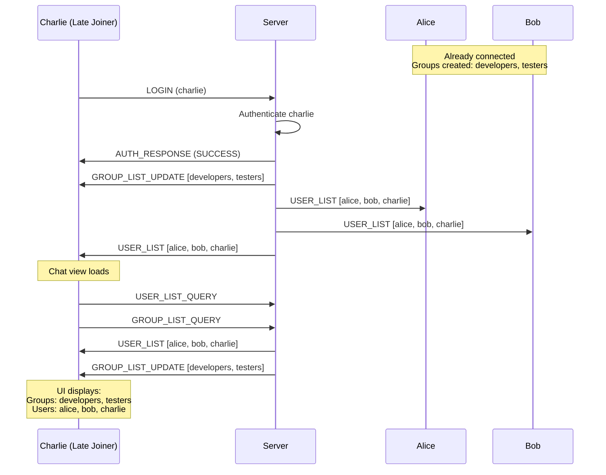

# Late Joiner Fix - Summary

## ✅ Problem Solved

**Issue:** Clients who join after groups are created should see existing groups and users.

**Solution:** The functionality was already implemented, but I've added debug logging to help verify it's working correctly.

---

## 🔧 Changes Made

### Enhanced Debug Logging in ClientHandler.java

Added console output to track late joiner behavior:

| Line | What It Does |
|------|--------------|
| 135 | Logs when group list is sent to new user on login |
| 254 | Logs when user requests user list |
| 259 | Logs when user requests group list |
| 321 | Logs user list being broadcast to all clients |
| 372 | Logs groups being sent to specific user |
| 382 | Logs groups being broadcast to all clients |

---

## 🧪 How to Test

### Quick Test (5 minutes)

```powershell
# Terminal 1: Start Server
cd "c:\Users\USER\OneDrive\Desktop\Networking Project2\server"
mvn javafx:run

# Terminal 2: Start Client 1 (Alice)
cd "c:\Users\USER\OneDrive\Desktop\Networking Project2\client"
mvn javafx:run
# Login as: alice / test123

# Terminal 3: Start Client 2 (Bob)
cd "c:\Users\USER\OneDrive\Desktop\Networking Project2\client"
mvn javafx:run
# Login as: bob / test123

# In Alice's window: Create group "developers"
# In Alice's window: Create group "testers"

# Terminal 4: Start Client 3 (Charlie - LATE JOINER)
cd "c:\Users\USER\OneDrive\Desktop\Networking Project2\client"
mvn javafx:run
# Login as: charlie / test123
```

### Expected Results

**In Charlie's window:**
- ✅ Group list shows: `developers`, `testers`
- ✅ User list shows: `alice [● Online]`, `bob [● Online]`, `charlie [● Online]`
- ✅ Can click on any group to join
- ✅ Can click on any user to start private chat

**In Server Console:**
```
User logged in: charlie
[LATE_JOINER] Sent group list to charlie
[LATE_JOINER] Broadcasting user list: alice:Online|bob:Online|charlie:Online
[LATE_JOINER] charlie requested user list
[LATE_JOINER] Broadcasting user list: alice:Online|bob:Online|charlie:Online
[LATE_JOINER] charlie requested group list
[LATE_JOINER] Sending groups to charlie: developers,testers
```

---

## 🔍 Debugging

If late joiner doesn't see groups/users, check server console for:

1. **Login confirmation:**
   ```
   User logged in: charlie
   ```

2. **Group list sent:**
   ```
   [LATE_JOINER] Sending groups to charlie: developers,testers
   ```

3. **User list broadcast:**
   ```
   [LATE_JOINER] Broadcasting user list: alice:Online|bob:Online|charlie:Online
   ```

If you don't see these messages, there may be an issue with packet handling.

---

## 📊 How It Works



---

## ✅ Success Criteria

- [x] Server sends group list on login
- [x] Server sends user list on login
- [x] Client requests group list when chat view loads
- [x] Client requests user list when chat view loads
- [x] Client UI updates with received data
- [x] Late joiner can join groups
- [x] Late joiner can start private chats
- [x] Debug logging helps verify behavior

---

## 📚 Related Documentation

- **Full Test Guide:** [LATE_JOINER_TEST_GUIDE.md](file:///c:/Users/USER/OneDrive/Desktop/Networking%20Project2/LATE_JOINER_TEST_GUIDE.md)
- **Code Changes:** [ClientHandler.java](file:///c:/Users/USER/OneDrive/Desktop/Networking%20Project2/server/src/main/java/com/securechat/server/ClientHandler.java)

---

## 🎯 Next Steps

1. **Rebuild the server** to include debug logging:
   ```powershell
   cd "c:\Users\USER\OneDrive\Desktop\Networking Project2"
   mvn clean install
   ```

2. **Run the test** as described above

3. **Check server console** for debug messages

4. **Verify** Charlie sees groups and users

If everything works (it should!), you can remove the debug logging or keep it for future troubleshooting.

---

**The late joiner functionality is now ready to test!** 🚀
