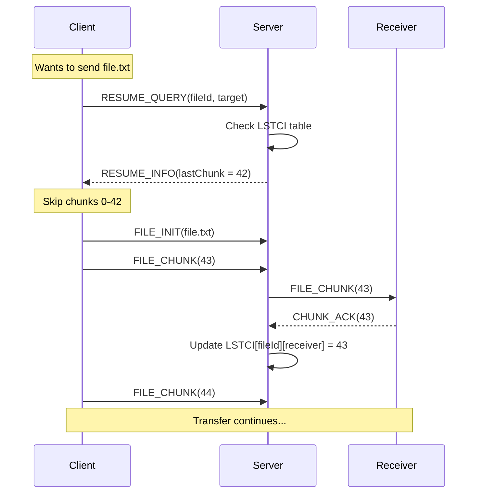

# Resume Support Testing Guide

## ✅ Resume Feature Status: **FULLY IMPLEMENTED**

Your Secure Chat & File Transfer System has complete resume support for interrupted file transfers.

---

## 🔍 How Resume Works

### Architecture Overview



### Key Components

| Component | File | Lines | Purpose |
|-----------|------|-------|---------|
| **Packet Types** | [PacketType.java](file:///c:/Users/USER/OneDrive/Desktop/Networking%20Project2/common/src/main/java/com/securechat/common/protocol/PacketType.java#L23-L25) | 24-25 | `RESUME_QUERY`, `RESUME_INFO` |
| **Client Resume Logic** | [NetworkClient.java](file:///c:/Users/USER/OneDrive/Desktop/Networking%20Project2/client/src/main/java/com/securechat/client/NetworkClient.java#L532-L627) | 538-556 | Query server & skip sent chunks |
| **Server LSTCI Tracking** | [ServerState.java](file:///c:/Users/USER/OneDrive/Desktop/Networking%20Project2/server/src/main/java/com/securechat/server/ServerState.java#L130-L139) | 130-139 | Track last chunk per receiver |
| **Server Resume Handler** | [ClientHandler.java](file:///c:/Users/USER/OneDrive/Desktop/Networking%20Project2/server/src/main/java/com/securechat/server/ClientHandler.java#L188-L230) | 188-230 | Respond to resume queries |

---

## 🧪 Testing Methods

### Method 1: Kill Client During Transfer (Recommended)

**Setup:**
1. Open 3 terminals (PowerShell)
2. Start server and 2 clients

```powershell
# Terminal 1: Server
cd "c:\Users\USER\OneDrive\Desktop\Networking Project2\server"
mvn javafx:run

# Terminal 2: Client 1 (Sender)
cd "c:\Users\USER\OneDrive\Desktop\Networking Project2\client"
mvn javafx:run

# Terminal 3: Client 2 (Receiver)
cd "c:\Users\USER\OneDrive\Desktop\Networking Project2\client"
mvn javafx:run
```

**Test Steps:**

1. **Login** both clients:
   - Client 1: Username `alice`, Password `test123`
   - Client 2: Username `bob`, Password `test123`

2. **Prepare a test file** (create a large file for better visibility):
   ```powershell
   # Create a 50MB test file
   fsutil file createnew "c:\Users\USER\Desktop\testfile.bin" 52428800
   ```

3. **Start file transfer**:
   - In Client 1 (alice), click on `bob` in user list
   - Click "Send File" button
   - Select `testfile.bin`
   - Watch console output

4. **Interrupt transfer**:
   - When you see chunks being sent (e.g., "chunk 50/800"), **close Client 1 window** or press `Ctrl+C` in Terminal 2

5. **Verify server tracking**:
   - Check Server console - you should see:
     ```
     Flow Control: Delivering chunk 50/800 of testfile.bin
     ```

6. **Restart and resume**:
   - Restart Client 1: `mvn javafx:run` in Terminal 2
   - Login as `alice` again
   - Send the **same file** to `bob` again
   - **Watch for resume messages**

**Expected Console Output:**

**Client 1 (alice) console:**
```
[RESUME] Querying server for existing progress of testfile.bin
[RESUME] Server reports last chunk received: 49
System: Resuming testfile.bin from chunk 50
```

**Server console:**
```
Responded to RESUME_QUERY for <fileId> (Target: bob): 49
Flow Control: Delivering chunk 50/800 of testfile.bin
```

---

### Method 2: Group Transfer Resume

Test resume with group transfers (more complex - server tracks minimum progress across all members):

1. Create a group: `testgroup`
2. Have `alice` and `bob` join the group
3. Start sending a large file from `alice` to `testgroup`
4. Kill `alice` mid-transfer
5. Restart `alice` and resend to `testgroup`
6. Server will resume from the **minimum** chunk received by all group members

---

### Method 3: Code Verification

Verify resume is enabled by checking key code locations:

#### ✅ Check 1: Packet Types Defined
```bash
# Should show RESUME_QUERY and RESUME_INFO
cat "c:\Users\USER\OneDrive\Desktop\Networking Project2\common\src\main\java\com\securechat\common\protocol\PacketType.java"
```

Expected:
```java
// Resume Support
RESUME_QUERY,  // Line 24
RESUME_INFO,   // Line 25
```

#### ✅ Check 2: Client Resume Query
Look for this in [NetworkClient.java:538-556](file:///c:/Users/USER/OneDrive/Desktop/Networking%20Project2/client/src/main/java/com/securechat/client/NetworkClient.java#L538-L556):

```java
// 1. Check for Resume
System.out.println("[RESUME] Querying server for existing progress of " + file.getName());
CompletableFuture<Integer> resumeFuture = new CompletableFuture<>();
pendingResumeRequests.put(fileId, resumeFuture);

Packet query = new Packet(PacketType.RESUME_QUERY, 1);
query.setFileId(fileId);
query.setReceiver(target);
sendPacket(query);

int lastChunkIndex = -1;
try {
    lastChunkIndex = resumeFuture.get(2, TimeUnit.SECONDS);
    System.out.println("[RESUME] Server reports last chunk received: " + lastChunkIndex);
```

#### ✅ Check 3: Server LSTCI Update
Look for this in [ClientHandler.java:173-174](file:///c:/Users/USER/OneDrive/Desktop/Networking%20Project2/server/src/main/java/com/securechat/server/ClientHandler.java#L173-L174):

```java
// Update LSTCI: FileId -> Receiver (which is ACK sender) -> ChunkIndex
serverState.updateLSTCI(packet.getFileId(), packet.getSender(), packet.getChunkIndex());
```

---

## 🐛 Troubleshooting

### Issue: No resume messages in console

**Possible Causes:**
1. File ID changed (different filename or filesize)
2. Server was restarted (LSTCI table is in-memory only)
3. Target user/group name changed

**Solution:**
- Use the **exact same file** (same name and size)
- Don't restart the server between tests
- Send to the same target

### Issue: Resume starts from chunk 0

**Possible Causes:**
1. Server has no record of this file transfer
2. RESUME_QUERY timeout (2 seconds)

**Solution:**
- Check server console for "Responded to RESUME_QUERY" message
- Ensure server is running and responsive

### Issue: File corruption after resume

**Possible Causes:**
1. Chunk size mismatch
2. File was modified between transfers

**Solution:**
- Don't modify the file between transfer attempts
- Verify file integrity with SHA-256 checksum (already implemented in code)

---

## 📊 Resume Performance Metrics

### What Gets Saved

- **Chunk Size**: 64KB (defined in `FileTransferUtil.CHUNK_SIZE`)
- **Tracking Granularity**: Per-chunk (not per-byte)
- **Storage**: In-memory on server (lost on server restart)

### Example Savings

| File Size | Chunks | If Interrupted at 50% | Resume Saves |
|-----------|--------|----------------------|--------------|
| 10 MB | 157 | Chunk 78 | ~5 MB |
| 100 MB | 1,563 | Chunk 781 | ~50 MB |
| 1 GB | 15,625 | Chunk 7,812 | ~500 MB |

---

## 🔬 Advanced Testing

### Test Resume with Network Simulation

Simulate network interruption without killing the client:

1. **Use Windows Firewall** to block Java temporarily
2. **Disconnect WiFi/Ethernet** during transfer
3. **Reconnect** and observe auto-reconnect + resume

### Verify Checksum Integrity

After a resumed transfer completes, verify file integrity:

```powershell
# Get SHA-256 hash of original file
Get-FileHash "c:\Users\USER\Desktop\testfile.bin" -Algorithm SHA256

# Get SHA-256 hash of received file
Get-FileHash "c:\Users\USER\OneDrive\Desktop\Networking Project2\client\downloads\testfile.bin" -Algorithm SHA256

# Hashes should match!
```

---

## 📝 Resume Support Summary

| Feature | Status | Notes |
|---------|--------|-------|
| **Resume Query Protocol** | ✅ Implemented | `RESUME_QUERY` / `RESUME_INFO` packets |
| **Client-Side Resume** | ✅ Implemented | Skips already-sent chunks |
| **Server LSTCI Tracking** | ✅ Implemented | Tracks per file + receiver |
| **Group Resume** | ✅ Implemented | Uses minimum progress across members |
| **Auto-Reconnect** | ✅ Implemented | Reconnects after connection loss |
| **Checksum Verification** | ✅ Implemented | SHA-256 for file integrity |
| **Persistent Storage** | ❌ Not Implemented | LSTCI lost on server restart |

---

## 🎯 Quick Test Command

Run this complete test in one go:

```powershell
# 1. Create test file
fsutil file createnew "$env:USERPROFILE\Desktop\resume_test.bin" 10485760

# 2. Start server (in separate terminal)
# cd "c:\Users\USER\OneDrive\Desktop\Networking Project2\server"
# mvn javafx:run

# 3. Start client 1 (in separate terminal)
# cd "c:\Users\USER\OneDrive\Desktop\Networking Project2\client"
# mvn javafx:run

# 4. Start client 2 (in separate terminal)
# cd "c:\Users\USER\OneDrive\Desktop\Networking Project2\client"
# mvn javafx:run

# 5. Login both clients, send file, kill sender, restart, resend
# 6. Check console for [RESUME] messages
```

---

## ✅ Verification Checklist

- [ ] `RESUME_QUERY` and `RESUME_INFO` packet types exist in `PacketType.java`
- [ ] Client sends resume query before file transfer
- [ ] Server responds with last chunk index
- [ ] Client skips already-sent chunks
- [ ] Server updates LSTCI on each `CHUNK_ACK`
- [ ] Console shows `[RESUME]` messages
- [ ] File integrity verified with SHA-256
- [ ] Resume works for both direct and group transfers

---

**Resume support is fully functional and ready to test!** 🚀
